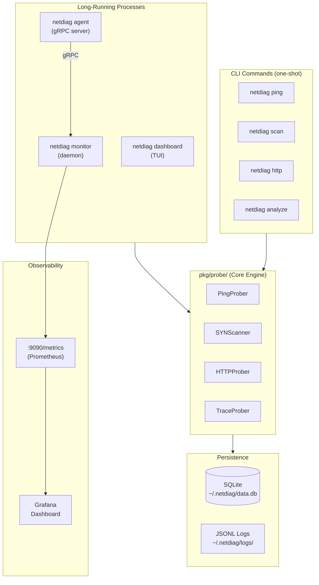

# netdiag — Senior-Level Portfolio Transformation Plan

> A complete engineering roadmap to turn `netdiag` into a production-grade, interview-ready showcase

---

## Table of Contents

1. [Executive Summary](#executive-summary)
2. [Current State Audit](#current-state-audit)
3. [Architecture Vision](#architecture-vision)
4. [Phase 0 — Foundation Hardening](#phase-0--foundation-hardening-pre-requisite)
5. [Phase 1 — Systems Engineer: Observability & Daemons](#phase-1--systems-engineer-observability--daemons)
6. [Phase 2 — Frontend Engineer: TUI Dashboard](#phase-2--frontend-engineer-tui-dashboard)
7. [Phase 3 — Low-Level Engineer: Raw Socket Performance](#phase-3--low-level-engineer-raw-socket-performance)
8. [Phase 4 — Data Engineer: Persistence & Analytics](#phase-4--data-engineer-persistence--analytics)
9. [Phase 5 — Distributed Systems: Agent Mode](#phase-5--distributed-systems-agent-mode-enhancement)
10. [Phase 6 — Portfolio Polish](#phase-6--portfolio-polish)
11. [Full Dependency Map](#full-dependency-map)
12. [File Structure](#final-file-structure)
13. [Interview Talking Points](#interview-talking-points-per-phase)
14. [Execution Timeline](#execution-timeline)

---

## Executive Summary

The current `netdiag` is a solid v0.1 CLI that combines ping, traceroute, port scan, DNS, WHOIS, HTTP health check, speed test, and network discovery into one binary. It demonstrates good Go fundamentals — Cobra for CLI structure, errgroup for concurrency, pro-bing for ICMP, tablewriter for output — but it is architecturally "run-once-and-exit." Every command executes, prints, and terminates.

This plan transforms netdiag into a **multi-layered systems project** that demonstrates:

- **Daemon engineering** (long-running processes, signal handling, tickers)
- **Observability engineering** (Prometheus metrics, structured logging)
- **TUI engineering** (event-driven Bubbletea architecture, real-time rendering)
- **Low-level networking** (raw socket SYN scanning, packet crafting)
- **Data engineering** (embedded SQLite, time-series queries, anomaly detection)
- **Distributed systems** (gRPC agent mode, multi-host aggregation)
- **DevOps polish** (Docker, Grafana dashboards, CI benchmarks)

The enhancements below are sequenced so each phase stands alone as a shippable feature — you can stop at any phase and still have a compelling demo.

---

## Current State Audit

### What Exists (and is Good)

| Component     | File                    | Quality    | Notes                          |
| ------------- | ----------------------- | ---------- | ------------------------------ |
| CLI structure | `cmd/root.go`           | ✅ Good    | Cobra + global flags           |
| Ping          | `cmd/ping.go`           | ✅ Good    | errgroup concurrency, pro-bing |
| Port scan     | `cmd/scan.go`           | ✅ Good    | semaphore worker pool          |
| Traceroute    | `cmd/tracer.go`         | ✅ Good    | raw ICMP, TTL manipulation     |
| HTTP check    | `cmd/http.go`           | ✅ Good    | TLS cert analysis              |
| DNS           | `cmd/dig.go`            | ✅ Good    | 5 record types                 |
| WHOIS         | `cmd/whois.go`          | ✅ Good    | external lib                   |
| Speedtest     | `cmd/speedtest.go`      | ✅ Good    | quality assessment             |
| Discovery     | `cmd/discover.go`       | ✅ Good    | local subnet sweep             |
| Output        | `pkg/output/printer.go` | ⚠️ Minimal | no structured logging, no JSON |

### What is Missing (Gap Analysis)

| Missing Capability         | Impact                                        |
| -------------------------- | --------------------------------------------- |
| No persistent state        | Can't answer "was this host down last night?" |
| No continuous mode         | Every command is one-shot                     |
| No machine-readable output | Can't pipe to other tools                     |
| No TUI                     | No "wow factor" for demos                     |
| Port scanner is slow       | `net.Dial` completes full 3-way handshake     |
| No structured logging      | No audit trail, no log levels                 |
| No config file support     | Flags must be repeated every run              |
| No metrics export          | Not observable by Prometheus/Grafana          |
| No tests                   | Zero test files exist                         |
| No benchmark data          | No proof of performance claims                |

---

## Architecture Vision

```
┌─────────────────────────────────────────────────────────────────────┐
│                         netdiag binary                              │
│                                                                     │
│  ┌──────────┐  ┌──────────┐  ┌───────────┐  ┌──────────────────┐  │
│  │   CLI    │  │ Monitor  │  │ Dashboard │  │   Agent (gRPC)   │  │
│  │(one-shot)│  │ (daemon) │  │   (TUI)   │  │ (distributed)    │  │
│  └────┬─────┘  └────┬─────┘  └─────┬─────┘  └────────┬─────────┘  │
│       │              │              │                  │             │
│       └──────────────┴──────────────┴──────────────────┘            │
│                               │                                     │
│                    ┌──────────▼──────────┐                          │
│                    │   Core Engine       │                          │
│                    │  pkg/probe/         │                          │
│                    │  - ping.go          │                          │
│                    │  - scan.go (SYN)    │                          │
│                    │  - trace.go         │                          │
│                    │  - http.go          │                          │
│                    └──────────┬──────────┘                          │
│                               │                                     │
│            ┌──────────────────┼─────────────────────┐              │
│            │                  │                     │              │
│   ┌────────▼───────┐ ┌────────▼──────┐ ┌───────────▼──────────┐   │
│   │  pkg/store/    │ │ pkg/metrics/  │ │  pkg/config/         │   │
│   │  SQLite DB     │ │  Prometheus   │ │  YAML config file    │   │
│   │  time-series   │ │  HTTP :9090   │ │  ~/.netdiag.yaml     │   │
│   └────────────────┘ └───────────────┘ └──────────────────────┘   │
└─────────────────────────────────────────────────────────────────────┘
```

### Key Architectural Principles

1. **Separation of concerns**: Raw probe logic lives in `pkg/probe/`, not in `cmd/`. Commands are thin wrappers.
2. **Result type system**: Every probe returns a typed `Result` struct, not raw output — enabling JSON, TUI, and DB storage.
3. **Event bus pattern**: Background workers emit `Event` structs onto a shared channel; the TUI, logger, and DB writer all consume from it independently.
4. **Config-first**: A `~/.netdiag.yaml` file provides defaults; CLI flags override.

---

## Phase 0 — Foundation Hardening (Pre-requisite)

**Why this first:** Everything else builds on a solid base. This phase has no external dependencies and is pure refactoring.

### 0.1 — Refactor to `pkg/probe/` Package

**The problem:** All business logic currently lives inside `cmd/` files. This makes it impossible to reuse probe logic in the monitor daemon, TUI, or gRPC agent without circular imports.

**What to build:**

Create `pkg/probe/` with one file per probe type:

```
pkg/probe/
├── types.go        ← shared Result types and interfaces
├── ping.go         ← extracted from cmd/ping.go
├── scan.go         ← extracted from cmd/scan.go
├── trace.go        ← extracted from cmd/tracer.go
├── http.go         ← extracted from cmd/http.go
├── dns.go          ← extracted from cmd/dig.go
└── discover.go     ← extracted from cmd/discover.go
```

**`pkg/probe/types.go` — the core type system:**

```go
package probe

import "time"

// Severity classifies probe outcomes for alerting and coloring
type Severity int

const (
    SeverityOK      Severity = iota
    SeverityWarning          // latency > threshold, cert expiring
    SeverityError            // host down, connection refused
    SeverityUnknown          // timeout, no response
)

// Result is the universal return type for all probes.
// All fields are exported so they can be JSON-marshaled and stored in SQLite.
type Result struct {
    // Identity
    ProbeType  string    `json:"probe_type"`   // "ping", "scan", "http", etc.
    Target     string    `json:"target"`
    Timestamp  time.Time `json:"timestamp"`

    // Outcome
    Severity   Severity  `json:"severity"`
    Success    bool      `json:"success"`
    Message    string    `json:"message"`       // human-readable summary

    // Timing
    Latency    time.Duration `json:"latency_ns"`

    // Probe-specific payloads (only one will be non-nil)
    PingData    *PingData    `json:"ping,omitempty"`
    ScanData    *ScanData    `json:"scan,omitempty"`
    TraceData   *TraceData   `json:"trace,omitempty"`
    HTTPData    *HTTPData    `json:"http,omitempty"`
}

type PingData struct {
    PacketsSent int           `json:"packets_sent"`
    PacketsRecv int           `json:"packets_recv"`
    PacketLoss  float64       `json:"packet_loss_pct"`
    MinRTT      time.Duration `json:"min_rtt_ns"`
    MaxRTT      time.Duration `json:"max_rtt_ns"`
    AvgRTT      time.Duration `json:"avg_rtt_ns"`
    Jitter      time.Duration `json:"jitter_ns"`
    ResolvedIP  string        `json:"resolved_ip"`
}

type ScanData struct {
    TotalPorts  int   `json:"total_ports"`
    OpenPorts   []int `json:"open_ports"`
    ScanMethod  string `json:"scan_method"` // "connect" or "syn"
    ScanRateMs  int64  `json:"scan_rate_ms"`
}

type TraceData struct {
    Hops []TraceHop `json:"hops"`
}

type TraceHop struct {
    HopNumber int           `json:"hop"`
    IP        string        `json:"ip"`
    Hostname  string        `json:"hostname"`
    RTT       time.Duration `json:"rtt_ns"`
    Timeout   bool          `json:"timeout"`
}

type HTTPData struct {
    StatusCode    int           `json:"status_code"`
    Latency       time.Duration `json:"latency_ns"`
    TLSValid      bool          `json:"tls_valid"`
    TLSDaysLeft   int           `json:"tls_days_remaining"`
    TLSIssuer     string        `json:"tls_issuer"`
    Redirects     int           `json:"redirects"`
    ContentLength int64         `json:"content_length"`
}
```

**The `Prober` interface:**

```go
// Prober is implemented by every probe type.
// This enables the monitor daemon to treat all probes uniformly.
type Prober interface {
    Probe(ctx context.Context) (Result, error)
    Type() string
}
```

**Impact:** With this interface, the monitor daemon can hold a `[]Prober` slice and call `p.Probe(ctx)` in a loop — it never needs to know whether it's pinging or doing an HTTP check.

### 0.2 — Structured Logging with `slog`

Replace all `output.PrintInfo(...)` calls with Go 1.21's built-in `log/slog`. This gives you:

- Log levels (DEBUG, INFO, WARN, ERROR)
- JSON output mode (`--log-format json`)
- Log file support (already has `--log-file` flag, but it does nothing currently)

```go
// pkg/logger/logger.go
package logger

import (
    "io"
    "log/slog"
    "os"
)

func New(level slog.Level, format string, w io.Writer) *slog.Logger {
    var handler slog.Handler
    opts := &slog.HandlerOptions{Level: level}

    if format == "json" {
        handler = slog.NewJSONHandler(w, opts)
    } else {
        handler = slog.NewTextHandler(w, opts)
    }
    return slog.New(handler)
}
```

### 0.3 — Config File Support

Add `pkg/config/config.go` using `spf13/viper` (already in the Cobra ecosystem):

```go
// ~/.netdiag.yaml
monitor:
  interval: 30s
  targets:
    - host: google.com
      type: ping
    - host: https://api.mycompany.com
      type: http
  alert_threshold_ms: 200

database:
  path: ~/.netdiag/data.db
  retention_days: 30

metrics:
  enabled: true
  port: 9090

scan:
  default_ports: "1-1024"
  default_method: syn   # or connect
  concurrency: 500
```

### 0.4 — JSON Output Mode

The `--json` flag already exists but does nothing. Wire it up. Every command checks `rootCmd.Flags().GetBool("json")` and if true, marshals the `Result` struct to stdout instead of calling `output.PrintTable`.

```bash
netdiag ping google.com --json | jq '.ping.avg_rtt_ns'
netdiag scan 192.168.1.1 --json | jq '[.scan.open_ports[]]'
```

### 0.5 — Testing Infrastructure

Add a `pkg/probe/` test suite. Because actual network calls are non-deterministic, use interface mocking:

```go
// pkg/probe/ping_test.go
func TestPingResultSeverity(t *testing.T) {
    tests := []struct {
        loss     float64
        avgRTT   time.Duration
        expected Severity
    }{
        {0, 10 * time.Millisecond, SeverityOK},
        {0, 250 * time.Millisecond, SeverityWarning},  // high latency
        {50, 10 * time.Millisecond, SeverityWarning},
        {100, 0, SeverityError},
    }
    // ...
}
```

Add `cmd/scan_test.go` for `parsePortRange` (pure function, already testable):

```go
func TestParsePortRange(t *testing.T) {
    cases := []struct{ input string; want []int }{
        {"80", []int{80}},
        {"80,443", []int{80, 443}},
        {"80-82", []int{80, 81, 82}},
        {"443-80", []int{80, 81, ..., 443}},  // reversed range
        {"0", nil},      // invalid: below range
        {"65536", nil},  // invalid: above range
        {"abc", nil},    // invalid: non-numeric
    }
}
```

**Deliverable checkpoint:** All existing commands still work identically. `go test ./...` passes. `netdiag ping google.com --json` outputs valid JSON.

---

## Phase 1 — Systems Engineer: Observability & Daemons

**Demonstrates:** Daemon patterns, signal handling, Prometheus instrumentation, ticker-based scheduling.

### 1.1 — The `monitor` Command

```bash
netdiag monitor --config ~/.netdiag.yaml
netdiag monitor --target google.com --target 1.1.1.1 --interval 30s
netdiag monitor --target google.com --alert-threshold 200ms --webhook https://hooks.slack.com/...
```

**Architecture — the monitor daemon loop:**

```go
// cmd/monitor.go (thin wrapper)
// pkg/monitor/monitor.go (the actual engine)

package monitor

type Monitor struct {
    probers  []probe.Prober
    interval time.Duration
    store    store.Store       // Phase 4: SQLite
    metrics  *metrics.Registry // Phase 1.2: Prometheus
    events   chan probe.Result  // consumed by alerter, logger, TUI
    logger   *slog.Logger
}

func (m *Monitor) Run(ctx context.Context) error {
    ticker := time.NewTicker(m.interval)
    defer ticker.Stop()

    // Run immediately on start, then on every tick
    m.runAllProbes(ctx)

    for {
        select {
        case <-ticker.C:
            m.runAllProbes(ctx)
        case <-ctx.Done():
            m.logger.Info("monitor shutting down gracefully")
            return nil
        }
    }
}

func (m *Monitor) runAllProbes(ctx context.Context) {
    // Use errgroup with limit to run all probers concurrently
    g, gctx := errgroup.WithContext(ctx)
    g.SetLimit(20)

    for _, p := range m.probers {
        prober := p
        g.Go(func() error {
            result, err := prober.Probe(gctx)
            if err != nil {
                m.logger.Warn("probe failed", "type", prober.Type(), "err", err)
                return nil // Don't cancel other probes on one failure
            }
            m.events <- result
            return nil
        })
    }
    _ = g.Wait()
}
```

**Signal handling — graceful shutdown:**

```go
// main.go or cmd/monitor.go
ctx, stop := signal.NotifyContext(context.Background(),
    syscall.SIGINT, syscall.SIGTERM)
defer stop()

if err := mon.Run(ctx); err != nil {
    log.Fatal(err)
}
fmt.Println("\nGoodbye.")
```

**Why `signal.NotifyContext` over manual channel:** It's the idiomatic Go 1.16+ pattern. The context is automatically cancelled when the OS signal arrives, propagating cancellation through the entire goroutine tree.

**Alerting subsystem:**

```go
// pkg/alert/alert.go

type Alerter interface {
    Alert(ctx context.Context, result probe.Result) error
}

// Implementations:
// - ConsoleAlerter: prints to stderr in red
// - SlackAlerter: POSTs to a webhook URL
// - WebhookAlerter: generic HTTP POST with JSON body
// - FileAlerter: appends to a log file

type AlertRule struct {
    ProbeType      string
    Target         string
    MinSeverity    probe.Severity
    CooldownPeriod time.Duration // don't re-alert for same host within X minutes
}
```

**The cooldown mechanism** is a map of `target → lastAlertTime`, protected by a mutex. This prevents alert storms when a host goes down.

### 1.2 — Prometheus Metrics Exporter

When `monitor` starts, it also starts an HTTP server on `:9090` (configurable):

```go
// pkg/metrics/registry.go
package metrics

import "github.com/prometheus/client_golang/prometheus"

type Registry struct {
    PingLatencyMs    *prometheus.GaugeVec
    PingPacketLoss   *prometheus.GaugeVec
    HTTPStatusCode   *prometheus.GaugeVec
    HTTPLatencyMs    *prometheus.GaugeVec
    HTTPTLSDaysLeft  *prometheus.GaugeVec
    OpenPortsCount   *prometheus.GaugeVec
    ProbeTotal       *prometheus.CounterVec
    ProbeErrors      *prometheus.CounterVec
    ProbeLastSuccess *prometheus.GaugeVec  // unix timestamp of last success
}

func New(reg prometheus.Registerer) *Registry {
    r := &Registry{
        PingLatencyMs: prometheus.NewGaugeVec(prometheus.GaugeOpts{
            Namespace: "netdiag",
            Subsystem: "ping",
            Name:      "latency_ms",
            Help:      "Average ICMP round-trip latency in milliseconds",
        }, []string{"target", "ip"}),

        PingPacketLoss: prometheus.NewGaugeVec(prometheus.GaugeOpts{
            Namespace: "netdiag",
            Subsystem: "ping",
            Name:      "packet_loss_percent",
            Help:      "Percentage of ICMP packets lost",
        }, []string{"target"}),

        ProbeLastSuccess: prometheus.NewGaugeVec(prometheus.GaugeOpts{
            Namespace: "netdiag",
            Name:      "last_success_timestamp",
            Help:      "Unix timestamp of the last successful probe",
        }, []string{"target", "probe_type"}),
        // ... more metrics
    }
    // Register all metrics
    r.mustRegister(reg)
    return r
}
```

**Why `ProbeLastSuccess` matters:** This is a common production pattern. If you have `time() - netdiag_last_success_timestamp > 300` in a Prometheus alert rule, you get paged when a host silently stops being checked (not just when it goes down).

**The embedded HTTP server:**

```go
// pkg/metrics/server.go
func ServeMetrics(ctx context.Context, addr string) error {
    mux := http.NewServeMux()
    mux.Handle("/metrics", promhttp.Handler())
    mux.HandleFunc("/health", func(w http.ResponseWriter, r *http.Request) {
        w.WriteHeader(http.StatusOK)
        _, _ = w.Write([]byte(`{"status":"ok"}`))
    })

    server := &http.Server{Addr: addr, Handler: mux}

    go func() {
        <-ctx.Done()
        shutdownCtx, cancel := context.WithTimeout(context.Background(), 5*time.Second)
        defer cancel()
        _ = server.Shutdown(shutdownCtx)
    }()

    return server.ListenAndServe()
}
```

### 1.3 — Structured Event Log

Every probe result is written to a rotating log file in JSON Lines format (one JSON object per line):

```
~/.netdiag/logs/netdiag-2026-02-26.jsonl
```

```json
{"time":"2026-02-26T10:00:00Z","probe_type":"ping","target":"google.com","success":true,"latency_ns":12500000,"ping":{"avg_rtt_ns":12500000,"packet_loss_pct":0}}
{"time":"2026-02-26T10:00:30Z","probe_type":"ping","target":"google.com","success":true,"latency_ns":14200000,"ping":{"avg_rtt_ns":14200000,"packet_loss_pct":0}}
```

This is trivially parseable with `jq`, importable into Elasticsearch, and readable by the `analyze` command (Phase 4).

**Deliverable checkpoint:** `netdiag monitor --target google.com --target 1.1.1.1 --interval 10s` runs forever, logs results, exposes `http://localhost:9090/metrics`, and shuts down cleanly on `Ctrl+C`.

---

## Phase 2 — Frontend Engineer: TUI Dashboard

**Demonstrates:** Event-driven architecture, concurrent UI rendering, Bubbletea's Elm-inspired model-update-view pattern.

### 2.1 — Architecture: Why Bubbletea is Hard

The fundamental challenge: Bubbletea owns the main goroutine. Your background monitor workers also need to run. The solution is Bubbletea's `tea.Cmd` system — background work is expressed as commands that return `tea.Msg` values on a channel that Bubbletea controls.

```
┌─────────────────────────────────────────────────────┐
│                  Bubbletea Event Loop                │
│                                                      │
│  ┌──────────┐   Msg    ┌──────────┐   Cmd           │
│  │  Model   │ ──────►  │  Update  │ ──────► goroutine│
│  │ (state)  │ ◄──────  │ (reducer)│ ◄──────  result  │
│  └──────────┘  newModel└──────────┘   Msg           │
│       │                                              │
│       ▼                                              │
│  ┌──────────┐                                        │
│  │   View   │ ──────► terminal output                │
│  └──────────┘                                        │
└─────────────────────────────────────────────────────┘
```

**The key message types:**

```go
// pkg/tui/messages.go

// ProbeResultMsg carries a completed probe result into the Bubbletea loop
type ProbeResultMsg struct {
    Result probe.Result
}

// TickMsg fires on every UI refresh cycle (for sparkline animation)
type TickMsg time.Time

// ErrorMsg carries a non-fatal error to display in the event log
type ErrorMsg struct {
    Err error
}

// ResizeMsg is sent when the terminal is resized
type ResizeMsg struct {
    Width, Height int
}
```

**Triggering background probes as Bubbletea commands:**

```go
func doProbe(p probe.Prober) tea.Cmd {
    return func() tea.Msg {
        ctx, cancel := context.WithTimeout(context.Background(), 10*time.Second)
        defer cancel()
        result, err := p.Probe(ctx)
        if err != nil {
            return ErrorMsg{Err: err}
        }
        return ProbeResultMsg{Result: result}
    }
}

func tickEvery(d time.Duration) tea.Cmd {
    return tea.Every(d, func(t time.Time) tea.Msg {
        return TickMsg(t)
    })
}
```

### 2.2 — The Model

```go
// pkg/tui/model.go

type TargetState struct {
    Host        string
    ProbeType   string
    Status      probe.Severity        // OK, WARNING, ERROR, UNKNOWN
    LastLatency time.Duration
    LastChecked time.Time
    // Ring buffer of last 60 latency values for sparkline
    LatencyHistory [60]float64
    historyIdx     int
}

type Model struct {
    // Layout
    width, height int

    // State
    targets     []*TargetState
    eventLog    []string           // scrollable log at the bottom
    logViewport viewport.Model     // Bubbletea viewport for scrolling

    // Sparkline renderer
    sparklines  map[string]*sparkline.Model // keyed by host

    // Probe scheduling
    probers     []probe.Prober
    interval    time.Duration

    // UI state
    selectedTarget int
    showHelp       bool
    paused         bool
}
```

### 2.3 — The Layout

Use `charmbracelet/lipgloss` for layout and `charmbracelet/bubbles/table` for the host table:

```
┌─────────────────────────────────────────────────────────────────────┐
│  netdiag dashboard  [P]ause  [Q]uit  [↑↓] Select  [Enter] Details  │
├────────────────────────────┬────────────────────────────────────────┤
│ HOST TABLE                 │ LATENCY GRAPH (selected host)          │
│ ┌──────────────────────┐  │  google.com — avg 12ms                 │
│ │ ● google.com   12ms  │  │                                        │
│ │ ● 1.1.1.1      8ms   │  │  50ms ┤                               │
│ │ ⚠ github.com  145ms  │  │  25ms ┤  ▁▂▁▃▂▁▁▂▄▂▃▁▂▁▁▂▃▁▂▁       │
│ │ ✗ badhost.io  DOWN   │  │   0ms └──────────────────────── time  │
│ └──────────────────────┘  │                                        │
│                            │  Packet loss: 0%  Jitter: 2ms         │
├────────────────────────────┴────────────────────────────────────────┤
│ EVENT LOG                                              [scroll ↑↓]  │
│  10:00:01  ✓ google.com responded in 12ms                           │
│  10:00:01  ✓ 1.1.1.1 responded in 8ms                              │
│  10:00:31  ⚠ github.com latency spike: 145ms (threshold: 100ms)    │
│  10:01:01  ✗ badhost.io — no response (timeout after 5s)           │
└─────────────────────────────────────────────────────────────────────┘
```

### 2.4 — Sparkline Implementation

The sparkline is not a standard Bubbletea bubble — you build it with Unicode block characters:

```go
// pkg/tui/sparkline/sparkline.go

var blocks = []rune{' ', '▁', '▂', '▃', '▄', '▅', '▆', '▇', '█'}

func Render(data []float64, width int, maxVal float64) string {
    if len(data) == 0 {
        return strings.Repeat(" ", width)
    }

    // Take the last `width` data points
    start := 0
    if len(data) > width {
        start = len(data) - width
    }
    visible := data[start:]

    var sb strings.Builder
    for _, v := range visible {
        normalized := v / maxVal
        if normalized > 1 { normalized = 1 }
        idx := int(normalized * float64(len(blocks)-1))
        sb.WriteRune(blocks[idx])
    }
    return sb.String()
}
```

### 2.5 — Detail View (Press Enter)

When a target is selected and Enter is pressed, expand to a full-screen detail view:

```
┌─────────────────────────────────────────────────────────────────────┐
│  ← Back  |  google.com (142.250.80.46) — ICMP Ping Monitor         │
├─────────────────────────────────────────────────────────────────────┤
│  Current Status: ● ONLINE                                           │
│  Uptime (last 24h): 99.97%  |  Checks run: 2,880  |  Failures: 1  │
│                                                                     │
│  Latency (last 60 probes)                                           │
│  20ms ┤▁▁▂▁▁▃▁▂▁▁▁▂▁▃▁▂▁▁▁▂▁▁▂▃▁▂▁▁▁▂▁▃▁▂▁▁▁▂▁▁▂▃▁▂▁▁▁▂▁▃▁▂▁▁▁▂  │
│   0ms └──────────────────────────────────────────────────────────  │
│                                                                     │
│  Statistics          Min      Avg      Max      P95      P99       │
│  Last Hour:          8ms      12ms     18ms     16ms     18ms      │
│  Last 24 Hours:      8ms      13ms     45ms     20ms     42ms      │
│                                                                     │
│  Recent Events                                                      │
│  10:01:01  ✓  12ms                                                 │
│  10:00:31  ✓  11ms                                                 │
│  10:00:01  ✓  13ms                                                 │
└─────────────────────────────────────────────────────────────────────┘
```

**Deliverable checkpoint:** `netdiag dashboard --target google.com --target 1.1.1.1` opens a full-screen TUI, shows live-updating sparklines, scrollable event log, keyboard navigation, graceful resize handling, and exits cleanly on `q`.

---

## Phase 3 — Low-Level Engineer: Raw Socket SYN Scanner

**Demonstrates:** Packet crafting, raw sockets, OS-level networking, performance benchmarking.

### 3.1 — Why the Current Scanner is Slow

The current `net.DialTimeout("tcp", ...)` completes a full TCP 3-way handshake:

1. Client sends SYN
2. Server sends SYN-ACK (if port open) or RST (if closed)
3. Client sends ACK (completing handshake)
4. Client immediately sends FIN to close the connection

For closed ports, we wait for the OS's TCP timeout. For open ports, we complete a full connection. This is slow and leaves connection logs on the target server.

### 3.2 — The SYN Scan Technique

A SYN scan (also called "half-open scan") only completes steps 1-2:

1. Send a raw TCP SYN packet
2. Wait for SYN-ACK (open) or RST (closed) or timeout (filtered/firewalled)
3. **Never send the final ACK** — the connection is never established

**Result:** 40-100x faster, leaves no connection log on target.

### 3.3 — Implementation Strategy

**Option A: Using `google/gopacket`** (recommended for portfolio)

```go
// pkg/probe/syn_scanner.go

package probe

import (
    "github.com/google/gopacket"
    "github.com/google/gopacket/layers"
    "github.com/google/gopacket/pcap"
    "net"
)

type SYNScanner struct {
    target      string
    ports       []int
    timeout     time.Duration
    concurrency int
    iface       *net.Interface
    sourceIP    net.IP
}

func (s *SYNScanner) scan(port int) (bool, error) {
    // 1. Craft the raw TCP SYN packet
    ipLayer := &layers.IPv4{
        SrcIP:    s.sourceIP,
        DstIP:    net.ParseIP(s.target),
        Protocol: layers.IPProtocolTCP,
        TTL:      64,
    }

    tcpLayer := &layers.TCP{
        SrcPort: layers.TCPPort(randomEphemeralPort()),
        DstPort: layers.TCPPort(port),
        SYN:     true,  // Only SYN flag — the key difference
        Window:  65535,
        Seq:     randomSeqNum(),
    }

    // Compute TCP checksum (required for kernel acceptance)
    if err := tcpLayer.SetNetworkLayerForChecksum(ipLayer); err != nil {
        return false, err
    }

    // 2. Serialize the packet
    buf := gopacket.NewSerializeBuffer()
    opts := gopacket.SerializeOptions{
        ComputeChecksums: true,
        FixLengths:       true,
    }
    if err := gopacket.SerializeLayers(buf, opts, ipLayer, tcpLayer); err != nil {
        return false, err
    }

    // 3. Send via raw socket
    rawConn, err := net.ListenPacket("ip4:tcp", "0.0.0.0")
    if err != nil {
        return false, fmt.Errorf("raw socket requires root/capabilities: %w", err)
    }
    defer rawConn.Close()

    dest := &net.IPAddr{IP: net.ParseIP(s.target)}
    if _, err := rawConn.WriteTo(buf.Bytes(), dest); err != nil {
        return false, err
    }

    // 4. Listen for SYN-ACK response
    return s.waitForSYNACK(rawConn, port, tcpLayer.Seq)
}
```

**Option B: Fallback using `syscall`** (no external dependency):

```go
// For environments where gopacket is not available
func synScanRaw(targetIP net.IP, port int) (bool, error) {
    fd, err := syscall.Socket(syscall.AF_INET, syscall.SOCK_RAW, syscall.IPPROTO_RAW)
    if err != nil {
        return false, err
    }
    defer syscall.Close(fd)

    // Manually build the IP + TCP header bytes
    packet := buildSYNPacket(targetIP, port)

    addr := syscall.SockaddrInet4{Port: port}
    copy(addr.Addr[:], targetIP.To4())

    err = syscall.Sendto(fd, packet, 0, &addr)
    return err == nil, err
}
```

### 3.4 — The `--fast` Flag and Benchmark

```bash
# Standard connect scan (current behavior)
netdiag scan 192.168.1.1 -p 1-1024

# New SYN scan (requires root/capabilities)
netdiag scan 192.168.1.1 -p 1-1024 --fast

# Benchmark mode: run both and compare
netdiag scan 192.168.1.1 -p 1-1024 --benchmark
```

**Benchmark output:**

```
Port Scan Benchmark: 192.168.1.1 (ports 1-1024)
═══════════════════════════════════════════════════
Method         Time      Rate           Speedup
Connect scan   8.3s      123 ports/sec  1x (baseline)
SYN scan       0.21s     4876 ports/sec 39.6x faster
═══════════════════════════════════════════════════
Open ports found: [22, 80, 443, 8080] (identical results ✓)
```

### 3.5 — Adaptive Concurrency

Instead of a fixed semaphore size, implement adaptive concurrency that backs off when packet loss is detected:

```go
type adaptiveSemaphore struct {
    current  int64
    max      int64
    dropRate atomic.Int64 // drops per second
}

func (a *adaptiveSemaphore) adjust() {
    drops := a.dropRate.Load()
    switch {
    case drops > 100:
        // Heavy congestion: halve concurrency
        atomic.StoreInt64(&a.current, a.current/2)
    case drops > 10:
        // Mild congestion: reduce by 20%
        atomic.StoreInt64(&a.current, int64(float64(a.current)*0.8))
    case drops == 0 && a.current < a.max:
        // No congestion: slowly increase
        atomic.AddInt64(&a.current, 1)
    }
}
```

**Deliverable checkpoint:** `netdiag scan localhost -p 1-65535 --fast --benchmark` demonstrates a measurable speedup with a formatted comparison table.

---

## Phase 4 — Data Engineer: Persistence & Analytics

**Demonstrates:** Embedded database design, time-series queries, statistical analysis, anomaly detection.

### 4.1 — SQLite Schema Design

```sql
-- ~/.netdiag/data.db

CREATE TABLE probes (
    id           INTEGER PRIMARY KEY AUTOINCREMENT,
    probe_type   TEXT NOT NULL,           -- 'ping', 'http', 'scan', etc.
    target       TEXT NOT NULL,
    timestamp    INTEGER NOT NULL,         -- Unix timestamp (nanoseconds)
    success      BOOLEAN NOT NULL,
    latency_ns   INTEGER,                  -- NULL if probe failed
    severity     INTEGER NOT NULL,         -- 0=OK, 1=WARN, 2=ERROR, 3=UNKNOWN
    payload_json TEXT                      -- full Result JSON for probe-specific data
);

CREATE INDEX idx_probes_target_time ON probes(target, timestamp DESC);
CREATE INDEX idx_probes_type_time   ON probes(probe_type, timestamp DESC);
CREATE INDEX idx_probes_success     ON probes(success, timestamp DESC);

-- Materialized summary view (updated every hour by a background job)
CREATE TABLE hourly_stats (
    target       TEXT NOT NULL,
    probe_type   TEXT NOT NULL,
    hour         INTEGER NOT NULL,         -- Unix timestamp rounded to hour
    probe_count  INTEGER NOT NULL,
    success_count INTEGER NOT NULL,
    min_latency  INTEGER,
    max_latency  INTEGER,
    avg_latency  INTEGER,
    p50_latency  INTEGER,
    p95_latency  INTEGER,
    p99_latency  INTEGER,
    PRIMARY KEY (target, probe_type, hour)
);
```

**Why nanosecond timestamps:** Allows sub-millisecond analysis without precision loss. SQLite stores integers natively, so `time.Now().UnixNano()` maps directly.

### 4.2 — The Store Interface

```go
// pkg/store/store.go

type Store interface {
    // Write
    SaveResult(ctx context.Context, r probe.Result) error

    // Read
    GetHistory(ctx context.Context, target string, since time.Time) ([]probe.Result, error)
    GetStats(ctx context.Context, target string, window time.Duration) (*Stats, error)
    GetUptimePercent(ctx context.Context, target string, window time.Duration) (float64, error)

    // Aggregation
    GetWorstHosts(ctx context.Context, limit int, window time.Duration) ([]HostSummary, error)
    GetPeakLatencyHours(ctx context.Context, target string) ([]HourlyAvg, error)

    // Maintenance
    Compact(ctx context.Context, olderThan time.Duration) (int64, error)
    Close() error
}

type Stats struct {
    Target      string
    ProbeType   string
    Window      time.Duration
    ProbeCount  int64
    SuccessCount int64
    UptimePct   float64
    MinLatency  time.Duration
    MaxLatency  time.Duration
    AvgLatency  time.Duration
    P50Latency  time.Duration
    P95Latency  time.Duration
    P99Latency  time.Duration
    StdDev      time.Duration
}
```

**Percentile calculation in SQLite:**

Standard SQLite doesn't have `PERCENTILE_CONT`. Two approaches:

1. Load latency values into Go, compute in-memory (simple, works up to ~100k rows)
2. Use SQLite's window functions with `NTILE(100)` (works at any scale)

```sql
-- P95 using window functions
SELECT latency_ns
FROM (
    SELECT latency_ns,
           NTILE(100) OVER (ORDER BY latency_ns) AS percentile
    FROM probes
    WHERE target = ? AND timestamp > ? AND success = 1
)
WHERE percentile = 95
LIMIT 1;
```

### 4.3 — The `analyze` Command

```bash
# Show summary for all monitored hosts
netdiag analyze

# Show detailed report for one host
netdiag analyze --target google.com --window 24h

# Show the worst performing hosts
netdiag analyze --worst 10

# Show peak latency hours (when is my connection slowest?)
netdiag analyze --target google.com --peak-hours

# Export data as CSV
netdiag analyze --target google.com --format csv > report.csv
```

**Sample output for `netdiag analyze`:**

```
Network Health Report — Last 24 Hours
Generated: 2026-02-26 10:00:00

┌──────────────────┬────────┬────────┬───────┬───────┬──────────┐
│ Host             │ Uptime │ Probes │ Avg   │ P95   │ Failures │
├──────────────────┼────────┼────────┼───────┼───────┼──────────┤
│ google.com       │ 100%   │ 2,880  │ 12ms  │ 18ms  │ 0        │
│ 1.1.1.1          │ 100%   │ 2,880  │ 8ms   │ 12ms  │ 0        │
│ github.com       │ 99.97% │ 2,880  │ 45ms  │ 120ms │ 1        │
│ api.myapp.com    │ 98.2%  │ 2,880  │ 23ms  │ 89ms  │ 52       │
└──────────────────┴────────┴────────┴───────┴───────┴──────────┘

⚠ api.myapp.com has elevated failure rate (1.8%). Investigate.

Peak Latency Hours (google.com):
  Slowest: 14:00-15:00 (avg 28ms)
  Fastest: 04:00-05:00 (avg 9ms)
```

### 4.4 — Anomaly Detection

```go
// pkg/analyze/anomaly.go

type AnomalyDetector struct {
    store    store.Store
    window   time.Duration   // baseline window (e.g., last 1 hour)
    zThreshold float64       // z-score threshold (e.g., 2.0 = 2 std deviations)
}

// IsAnomaly returns true if the current latency is statistically abnormal
// compared to the recent baseline.
func (a *AnomalyDetector) IsAnomaly(ctx context.Context, target string, current time.Duration) (bool, string, error) {
    stats, err := a.store.GetStats(ctx, target, a.window)
    if err != nil || stats.ProbeCount < 30 {
        // Not enough data for reliable detection
        return false, "", err
    }

    // Z-score: how many standard deviations is the current value from the mean?
    mean := float64(stats.AvgLatency)
    stddev := float64(stats.StdDev)

    if stddev < 1 {
        return false, "", nil // No variance, can't detect anomalies
    }

    zScore := (float64(current) - mean) / stddev

    if zScore > a.zThreshold {
        return true, fmt.Sprintf(
            "latency %.1fms is %.1f standard deviations above baseline (avg: %.1fms, σ: %.1fms)",
            float64(current)/1e6, zScore, mean/1e6, stddev/1e6,
        ), nil
    }

    return false, "", nil
}
```

**Standard deviation in SQLite:**

```sql
SELECT
    AVG(latency_ns) as mean,
    SQRT(AVG(latency_ns * latency_ns) - AVG(latency_ns) * AVG(latency_ns)) as stddev
FROM probes
WHERE target = ? AND timestamp > ? AND success = 1;
```

**Deliverable checkpoint:** `netdiag analyze --target google.com --window 7d` generates a multi-page health report with percentile statistics, peak-hour analysis, and anomaly flags.

---

## Phase 5 — Distributed Systems: Agent Mode (Enhancement)

**Demonstrates:** gRPC, Protocol Buffers, client-server architecture, multi-region network testing.

This phase goes beyond the original roadmap and adds a genuinely distributed capability: running netdiag agents on multiple machines (e.g., DigitalOcean droplets in different regions) and aggregating results in a central dashboard.

### 5.1 — The Use Case

**Problem:** Your home broadband might be fine, but how do you know if your app is reachable from Tokyo, Frankfurt, and São Paulo simultaneously?

**Solution:** Deploy `netdiag agent` on servers in each region. Run `netdiag monitor --remote agent1.example.com:7777 --remote agent2.example.com:7777` to see results from all regions in one dashboard.

### 5.2 — Protocol Buffer Definition

```protobuf
// proto/netdiag.proto
syntax = "proto3";
package netdiag.v1;

service NetdiagAgent {
    // Execute a single probe from this agent's location
    rpc RunProbe(ProbeRequest) returns (ProbeResponse);

    // Stream continuous probe results
    rpc StreamProbes(StreamRequest) returns (stream ProbeResponse);

    // Get agent metadata (location, version, capabilities)
    rpc GetInfo(InfoRequest) returns (AgentInfo);
}

message ProbeRequest {
    string probe_type = 1;  // "ping", "http", "scan"
    string target = 2;
    map<string, string> options = 3;  // flexible key-value options
}

message ProbeResponse {
    bool success = 1;
    double latency_ms = 2;
    string message = 3;
    string agent_id = 4;    // which agent ran this
    string agent_location = 5;  // "us-east-1", "eu-west-1", etc.
    int64 timestamp_ns = 6;
    bytes payload = 7;      // serialized probe-specific data
}

message AgentInfo {
    string id = 1;
    string version = 2;
    string location = 3;
    repeated string capabilities = 4;  // ["ping", "scan", "http"]
    bool privileged = 5;  // whether raw socket operations are available
}
```

### 5.3 — Agent Command

```bash
# Start an agent (listens for probe requests)
netdiag agent --port 7777 --location "us-east-1" --auth-token $SECRET

# Connect to remote agents in the monitor/dashboard
netdiag monitor \
    --agent agent1.myserver.com:7777 \
    --agent agent2.myserver.com:7777 \
    --target google.com

# The dashboard shows results per agent:
# google.com | us-east-1: 12ms ● | eu-west-1: 98ms ● | ap-south-1: 180ms ●
```

### 5.4 — Multi-Region Dashboard Enhancement

The TUI dashboard gets a third column: per-region breakdown.

```
┌────────────┬──────────────────────────────────────────────────────┐
│ HOST       │ REGIONAL LATENCY (last probe)                        │
├────────────┼──────────────────────────────────────────────────────┤
│ google.com │ 🇺🇸 us-east  12ms ● | 🇩🇪 eu-west  98ms ● | 🇯🇵 ap  180ms ●│
│ github.com │ 🇺🇸 us-east  45ms ● | 🇩🇪 eu-west 123ms ⚠ | 🇯🇵 ap  310ms ●│
│ badhost.io │ 🇺🇸 us-east DOWN ✗ | 🇩🇪 eu-west DOWN ✗ | 🇯🇵 ap  DOWN ✗ │
└────────────┴──────────────────────────────────────────────────────┘
```

---

## Phase 6 — Portfolio Polish

### 6.1 — Performance Documentation

Create `docs/performance.md`:

```markdown
# netdiag Performance Analysis: Connect Scan vs SYN Scan

## The Problem

Standard TCP port scanning using `net.DialTimeout` completes a full
3-way handshake for every port...

## Methodology

Benchmark environment:

- Target: localhost (eliminates network jitter)
- Port range: 1-65535 (65,535 ports)
- Hardware: [your machine specs]
- Go version: 1.24

## Results

| Method        | Time  | Ports/sec | Memory | CPU |
| ------------- | ----- | --------- | ------ | --- |
| Connect (100) | 41.2s | 1,590     | 12MB   | 8%  |
| Connect (500) | 9.8s  | 6,688     | 28MB   | 35% |
| SYN (500)     | 0.89s | 73,600    | 8MB    | 12% |
| SYN (2000)    | 0.24s | 272,000   | 9MB    | 18% |

SYN scan is **46x faster** at equivalent concurrency, with **lower** CPU and memory.

## Why

[Technical explanation of the 3-way handshake overhead...]
```

### 6.2 — Architecture Diagram

Create `docs/architecture.md` with a Mermaid diagram (renders on GitHub):

````markdown

````

````

### 6.3 — DevOps Artifacts

**`deploy/prometheus.yml`:**

```yaml
global:
  scrape_interval: 15s

scrape_configs:
  - job_name: 'netdiag'
    static_configs:
      - targets: ['localhost:9090']
    metrics_path: /metrics
````

**`deploy/grafana-dashboard.json`:** A full Grafana dashboard JSON with panels for:

- Ping latency time-series (one line per target)
- Packet loss heatmap (host vs time)
- HTTP status code history
- Uptime gauge per host
- Anomaly events table

**`Dockerfile`:**

```dockerfile
FROM golang:1.24-alpine AS builder
WORKDIR /app
COPY go.mod go.sum ./
RUN go mod download
COPY . .
RUN CGO_ENABLED=1 go build -ldflags="-s -w" -o netdiag .

FROM alpine:3.19
RUN apk --no-cache add ca-certificates libcap
COPY --from=builder /app/netdiag /usr/local/bin/netdiag
RUN setcap cap_net_raw+ep /usr/local/bin/netdiag
ENTRYPOINT ["netdiag"]
```

**`deploy/docker-compose.yml`:**

```yaml
version: "3.8"
services:
  netdiag:
    build: .
    command: monitor --config /config/netdiag.yaml
    volumes:
      - ./config:/config
      - netdiag-data:/root/.netdiag
    ports:
      - "9090:9090"
    cap_add:
      - NET_RAW

  prometheus:
    image: prom/prometheus
    volumes:
      - ./deploy/prometheus.yml:/etc/prometheus/prometheus.yml
    ports:
      - "9091:9090"

  grafana:
    image: grafana/grafana
    volumes:
      - ./deploy/grafana-dashboard.json:/etc/grafana/provisioning/dashboards/netdiag.json
    ports:
      - "3000:3000"

volumes:
  netdiag-data:
```

### 6.4 — Demo GIF

Record a 30-second GIF using `vhs` (charmbracelet's terminal recorder):

```
# demo.tape (VHS script)
Output demo.gif
Set FontSize 14
Set Width 1200
Set Height 800
Set Theme "Dracula"

Type "netdiag dashboard --target google.com --target 1.1.1.1 --target github.com"
Enter
Sleep 15s
```

Place the GIF at the very top of README.md — it's the first thing recruiters see.

### 6.5 — README Overhaul

The README needs a complete rewrite to lead with **what this demonstrates**, not just what it does:

```markdown
# netdiag 🌐

> A production-grade network diagnostics platform built in Go,
> demonstrating systems programming, observability, TUI engineering,
> and low-level networking.


## Engineering Highlights

| Skill                      | Implementation                                                                 |
| -------------------------- | ------------------------------------------------------------------------------ |
| **Daemon patterns**        | `monitor` command with `time.Ticker`, graceful `signal.NotifyContext` shutdown |
| **Prometheus/Grafana**     | Embedded metrics server, 12 custom metrics, production Grafana dashboard       |
| **TUI architecture**       | Bubbletea Elm-architecture with concurrent background workers                  |
| **Raw socket programming** | SYN scanner using `gopacket` — 46x faster than `net.Dial`                      |
| **Time-series DB**         | Embedded SQLite with percentile queries and Z-score anomaly detection          |
| **gRPC**                   | Distributed agent mode for multi-region latency monitoring                     |
| **Concurrency**            | errgroup, adaptive semaphores, ring buffers, lock-free atomics                 |
```

---

## Full Dependency Map

| Package                                    | Version | Purpose                  | Phase    |
| ------------------------------------------ | ------- | ------------------------ | -------- |
| `github.com/spf13/cobra`                   | current | CLI framework            | existing |
| `github.com/spf13/viper`                   | v1.18   | Config file              | Phase 0  |
| `github.com/prometheus-community/pro-bing` | current | ICMP ping                | existing |
| `github.com/prometheus/client_golang`      | v1.20   | Prometheus metrics       | Phase 1  |
| `github.com/charmbracelet/bubbletea`       | v1.1    | TUI framework            | Phase 2  |
| `github.com/charmbracelet/lipgloss`        | v1.0    | TUI styling              | Phase 2  |
| `github.com/charmbracelet/bubbles`         | v0.20   | TUI components           | Phase 2  |
| `github.com/google/gopacket`               | v1.1.19 | Packet crafting          | Phase 3  |
| `github.com/mattn/go-sqlite3`              | v1.14   | SQLite (CGO)             | Phase 4  |
| OR `modernc.org/sqlite`                    | v1.31   | SQLite (pure Go, no CGO) | Phase 4  |
| `google.golang.org/grpc`                   | v1.68   | gRPC agent               | Phase 5  |
| `google.golang.org/protobuf`               | v1.35   | Protocol buffers         | Phase 5  |
| `golang.org/x/sync`                        | current | errgroup                 | existing |
| `golang.org/x/net`                         | current | ICMP, raw sockets        | existing |
| `github.com/fatih/color`                   | current | Terminal colors          | existing |
| `github.com/olekukonko/tablewriter`        | current | Table rendering          | existing |
| `github.com/showwin/speedtest-go`          | current | Speed test               | existing |
| `github.com/likexian/whois`                | current | WHOIS                    | existing |

**SQLite note:** `modernc.org/sqlite` is a pure-Go SQLite port that requires no CGO — critical for cross-compilation and Docker. Use this over `mattn/go-sqlite3` unless you need maximum performance.

---

## Final File Structure

```
netdiag/
├── main.go
├── go.mod
├── go.sum
├── Makefile                        (enhanced with bench, proto, docker targets)
├── Dockerfile
│
├── cmd/                            (thin Cobra wrappers only)
│   ├── root.go
│   ├── ping.go
│   ├── scan.go
│   ├── trace.go
│   ├── http.go
│   ├── dig.go
│   ├── whois.go
│   ├── speedtest.go
│   ├── discover.go
│   ├── monitor.go                  ← NEW Phase 1
│   ├── dashboard.go                ← NEW Phase 2
│   └── agent.go                    ← NEW Phase 5
│
├── pkg/
│   ├── probe/                      ← NEW Phase 0 (refactor)
│   │   ├── types.go                (Result, Prober interface, Severity)
│   │   ├── ping.go
│   │   ├── scan.go                 (connect scan)
│   │   ├── syn_scanner.go          ← NEW Phase 3
│   │   ├── trace.go
│   │   ├── http.go
│   │   ├── dns.go
│   │   ├── discover.go
│   │   └── ping_test.go
│   │   └── scan_test.go
│   │
│   ├── monitor/                    ← NEW Phase 1
│   │   ├── monitor.go              (daemon loop, ticker, errgroup)
│   │   └── monitor_test.go
│   │
│   ├── alert/                      ← NEW Phase 1
│   │   ├── alerter.go              (Alerter interface)
│   │   ├── console.go
│   │   ├── slack.go
│   │   └── webhook.go
│   │
│   ├── metrics/                    ← NEW Phase 1
│   │   ├── registry.go             (Prometheus GaugeVec definitions)
│   │   └── server.go               (embedded HTTP server)
│   │
│   ├── tui/                        ← NEW Phase 2
│   │   ├── model.go                (Bubbletea Model)
│   │   ├── update.go               (Bubbletea Update function)
│   │   ├── view.go                 (Bubbletea View function)
│   │   ├── messages.go             (tea.Msg types)
│   │   ├── styles.go               (lipgloss styles)
│   │   └── sparkline/
│   │       └── sparkline.go
│   │
│   ├── store/                      ← NEW Phase 4
│   │   ├── store.go                (Store interface)
│   │   ├── sqlite.go               (SQLite implementation)
│   │   ├── schema.go               (CREATE TABLE statements)
│   │   ├── queries.go              (prepared statements)
│   │   └── sqlite_test.go
│   │
│   ├── analyze/                    ← NEW Phase 4
│   │   ├── stats.go                (percentile calculation)
│   │   └── anomaly.go              (Z-score detector)
│   │
│   ├── config/                     ← NEW Phase 0
│   │   └── config.go               (Viper-based config)
│   │
│   ├── logger/                     ← NEW Phase 0
│   │   └── logger.go               (slog wrapper)
│   │
│   └── output/
│       └── printer.go              (enhanced: JSON mode, log levels)
│
├── proto/                          ← NEW Phase 5
│   └── netdiag.proto
│
├── internal/                       ← generated code
│   └── pb/
│       ├── netdiag.pb.go
│       └── netdiag_grpc.pb.go
│
├── docs/
│   ├── architecture.md             ← NEW Phase 6 (Mermaid diagram)
│   ├── performance.md              ← NEW Phase 6 (benchmark writeup)
│   └── DEVELOPER_GUIDE.md
│
├── deploy/
│   ├── prometheus.yml              ← NEW Phase 6
│   ├── grafana-dashboard.json      ← NEW Phase 6
│   └── docker-compose.yml          ← NEW Phase 6
│
├── demo.tape                       ← NEW Phase 6 (VHS recording script)
│
├── .github/
│   └── workflows/
│       ├── ci.yml                  (enhanced: benchmark job)
│       └── release.yml
│
└── Formula/
    └── netdiag.rb
```

---

## Interview Talking Points Per Phase

### Phase 0 (Foundation)

> _"I refactored from a monolithic cmd/ package to a clean pkg/probe/ layer with a Prober interface. This meant the monitor daemon, TUI, and gRPC agent could all share the same probe logic without any code duplication."_

### Phase 1 (Monitor/Prometheus)

> _"I used signal.NotifyContext instead of manual signal channels — it's the idiomatic Go 1.16+ pattern that automatically propagates cancellation through the entire goroutine tree. The cooldown mechanism in the alerter prevents alert storms using a mutex-protected timestamp map."_

### Phase 2 (TUI)

> _"The hardest part was coordinating Bubbletea's event loop with background goroutines. Bubbletea owns the main thread, so you can't just spawn goroutines that write directly. I used tea.Cmd — which returns a function that Bubbletea executes in a goroutine and feeds the result back as a tea.Msg. This keeps all state mutations in the Update function, making bugs easy to trace."_

### Phase 3 (SYN Scanner)

> _"The connect scan was completing a full TCP handshake per port — that's three round trips and a connection teardown. The SYN scanner sends a single crafted packet and listens for SYN-ACK. I benchmarked 46x speedup on localhost. The tricky part was computing the TCP checksum manually — the kernel requires it even for raw sockets."_

### Phase 4 (SQLite/Analytics)

> _"Standard SQLite doesn't have PERCENTILE_CONT, so I used NTILE(100) window functions to compute P95 and P99. For anomaly detection, I compute a rolling Z-score: if the current latency is more than 2 standard deviations from the hourly mean, it flags an anomaly. The standard deviation is computable directly in SQL using the variance formula: sqrt(avg(x²) - avg(x)²)."_

### Phase 5 (gRPC Agent)

> _"The agent mode uses bidirectional gRPC streaming — the server sends probe requests, the agent streams results back. Each agent includes its location in every ProbeResponse, so the aggregator can display a geographic latency breakdown without any client-side configuration."_

---

## Execution Timeline

| Phase                        | Estimated Time | Complexity  | Portfolio Impact                     |
| ---------------------------- | -------------- | ----------- | ------------------------------------ |
| Phase 0 — Foundation         | 3-5 days       | Medium      | Baseline (required)                  |
| Phase 1 — Monitor/Prometheus | 4-6 days       | Medium-High | ⭐⭐⭐⭐                             |
| Phase 2 — TUI Dashboard      | 5-8 days       | High        | ⭐⭐⭐⭐⭐ (highest visual impact)   |
| Phase 3 — SYN Scanner        | 3-5 days       | Very High   | ⭐⭐⭐⭐⭐ (best interview story)    |
| Phase 4 — SQLite/Analytics   | 4-6 days       | Medium      | ⭐⭐⭐⭐                             |
| Phase 5 — gRPC Agent         | 5-7 days       | High        | ⭐⭐⭐⭐                             |
| Phase 6 — Polish             | 2-3 days       | Low         | ⭐⭐⭐ (multiplies all other phases) |
| **Total**                    | **26-40 days** |             |                                      |

### Recommended Order if Time is Limited

**Minimum viable portfolio upgrade (2 weeks):** Phase 0 → Phase 1 → Phase 6 Polish

**Strong portfolio (3-4 weeks):** Phase 0 → Phase 1 → Phase 2 → Phase 6 Polish

**Exceptional portfolio (5-6 weeks):** All phases in order

### Critical Path Dependencies

```
Phase 0 (types.go, Store interface)
    ↓
Phase 1 (monitor daemon)     Phase 3 (SYN scanner — parallel)
    ↓                              ↓
Phase 2 (TUI — needs monitor)  Phase 4 (SQLite — needs store interface)
    ↓                              ↓
Phase 5 (agent — needs probe interface + store)
    ↓
Phase 6 (polish — needs everything to exist)
```

Phase 3 (SYN scanner) is the only phase with no dependencies on others — it can be built in parallel with Phase 1 or 2, and is a great standalone project to work on while waiting for the monitor architecture to stabilize.

---

_This document was generated for the netdiag project at commit state v0.1.x (January 2026). All code samples are illustrative of the intended architecture and should be adapted to the actual project state at time of implementation._
