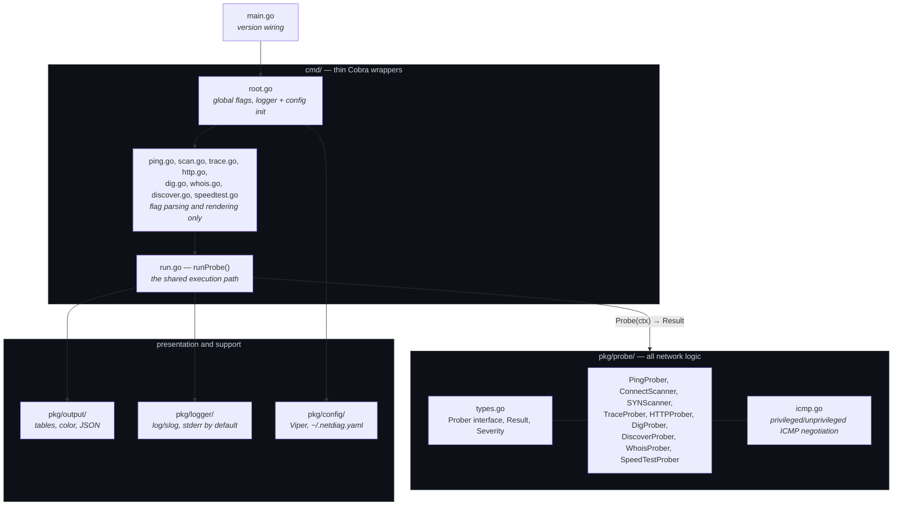

# Architecture

netdiag is a CLI with eight subcommands that do very different things — ICMP
echo, TCP port scanning, DNS queries, HTTP requests, WHOIS lookups. The design
problem is that users expect them to behave *identically* in every way that is
not about the network: the same JSON shape, the same exit codes, the same
response to Ctrl+C, the same place logs go.

The answer is a single interface, a single result type, and a single execution
path that every command routes through.

## Layout

The dependency direction is strict: `cmd/` imports `pkg/probe/`, never the
reverse. A probe cannot reach the terminal even by accident.

## The `Prober` contract

Every probe implements two methods: run against a context, and report its own
type name. That is the entire interface. Adding a probe means writing one file
in `pkg/probe/` and one thin file in `cmd/` — no registry, no plugin system, no
initialization order to get wrong.

The interface is deliberately narrow enough that `cmd/run.go` can be the only
consumer of it. When there is exactly one caller, behavior cannot drift between
commands, because there is no second place for it to drift to.

## Why probes never print

A probe returns a `Result` and prints nothing. This is the rule the rest of the
design hangs off, and it buys four things at once:

- **`--json` works everywhere for free.** There is no per-command JSON
  serialization to keep in sync with per-command table rendering, because the
  thing being serialized is the same value the renderer receives.
- **Probes are testable without capturing stdout.** Tests assert on a returned
  struct.
- **stdout stays clean.** Every diagnostic — logs, fallback notices, usage
  errors — goes to stderr, so `netdiag scan host --json | jq` never chokes on a
  warning that got mixed into the output.
- **One rendering path per format.** Color and table layout live in
  `pkg/output/`, used by `cmd/`, and nowhere else.

Where a probe genuinely needs to tell the user something mid-run — the SYN
scanner falling back to a connect scan, for instance — it takes a `Notify
func(string)` callback that the command points at stderr. The probe still does
not know what a terminal is.

## The `Result` envelope

One struct carries every probe's output: identity fields, an outcome
(`Success`, `Severity`, `Message`, `Latency`), and exactly one non-nil
probe-specific payload pointer. A ping fills `PingData`, a scan fills
`ScanData`, and the rest stay nil and are omitted from JSON.

This is a tagged union expressed with pointers rather than an interface, chosen
because it marshals to predictable JSON with no custom marshaler. The cost is
that `Result` grows a field per probe type; the benefit is that JSON consumers
see a stable, self-describing shape and the renderer can switch on which payload
is present.

## Severity and the exit-code contract

`Severity` is the probe's judgment about the target — not about whether the
probe worked. That distinction is what makes the exit codes useful in scripts:

| Code | Meaning |
|---|---|
| 0 | Ran; target is healthy **or** degraded-but-alive (`Warning`) |
| 1 | Ran; target failed (`Error`) |
| 2 | Bad arguments, flags, or configuration |
| 3 | Could not run — no privileges, unresolvable host |

**Warnings exit 0 on purpose.** A certificate with 10 days left, 25% packet loss
on a host that still answers, a scan interrupted part-way: all real conditions
worth reporting, none of them a reason to break `netdiag http api.example.com &&
./deploy.sh`. Scripts that want to be stricter read `.severity` from the JSON.

Inside a probe the same split applies. Returning `(Result{Severity: Error},
nil)` means "I ran; the target is bad." Returning an `error` means "I could not
run" — and `runProbe` turns that into an `ErrorResult` and exit 3. Getting this
backwards is the easiest way to make a scan of an unreachable host look like a
scan that found nothing.

## The shared runner

`cmd/run.go` owns every behavior that must not vary between commands:

| Concern | Where it is handled |
|---|---|
| Cancellation | `signal.NotifyContext` — Ctrl+C cancels the probe's context mid-flight |
| Error normalization | A returned error becomes a `Result` via `probe.ErrorResult` |
| Structured logging | One line per probe, always stderr or `--log-file` |
| `--json` | Short-circuits rendering and prints the `Result` |
| Color | `output.PrintBySeverity` maps severity to color |
| Exit code | Derived from `Success` and `Severity` |

`ping` is the one command that does not call `runProbe` directly, because it
targets several hosts at once. It reuses the same helpers (`logResult`,
`exitForAll`) rather than reimplementing them.

## ICMP privilege negotiation

Raw ICMP sockets need `CAP_NET_RAW` or root. Most systems also offer
*unprivileged* ICMP datagram sockets, which need neither — but Windows has none,
and Linux gates them behind a sysctl that is empty by default on some
distributions.

`pkg/probe/icmp.go` picks the mode most likely to work from `GOOS` and the
effective uid, retries with the other mode on a permission error, and caches
whichever worked for the rest of the process — so a `discover` sweep pinging
1,024 hosts pays the fallback cost at most once. When neither mode is available,
the error tells the user the exact command to fix it instead of surfacing a bare
`socket: permission denied`.

This pattern — try, detect the permission failure specifically, degrade rather
than fail — is reused by the SYN scanner.

## The SYN scanner

`--fast` replaces the connect scan's full TCP handshake with a half-open probe:
send a SYN, read the reply, never complete the connection. SYN-ACK means open,
RST means closed, silence means filtered.

Three things are worth pointing at:

- **The checksum is computed here, not by the packet library.** `gopacket` lays
  out and decodes the TCP header, but the checksum over the IPv4 pseudo-header
  is netdiag's own code, tested against the RFC 1071 worked example and a
  known-good vector generated independently.
- **Replies are correlated, not counted.** A raw socket receives *every* TCP
  segment on the machine, including this process's own outbound SYNs and the
  kernel's RSTs. A reply is only accepted if it arrives on the scan's source
  port and acknowledges the exact sequence number sent to that port.
- **It degrades instead of failing.** No `CAP_NET_RAW`, or no route-derived
  source address, and the scan falls back to the connect scanner with a one-line
  notice on stderr.

Measured performance, and the two bugs that benchmarking found, are in
[performance.md](performance.md).

## Concurrency

- **Connect scan** — semaphore-bounded worker pool, one goroutine per port,
  every dial carrying the cancellable context.
- **SYN scan** — one goroutine paces sends and owns the in-flight queue without
  locks; a pool of workers does nothing but write packets, from separate sockets
  because the kernel serializes writes per socket. Concurrency adapts by
  additive-increase/multiplicative-decrease.
- **Ping** — `errgroup` with `SetLimit`, so pinging 100 hosts does not open 100
  sockets at once.
- **Discover** — bounded sweep capped at 1,024 addresses, so a `/16` interface
  cannot launch a 65,000-host scan by accident.
